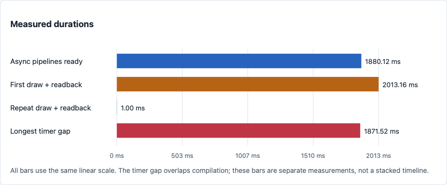
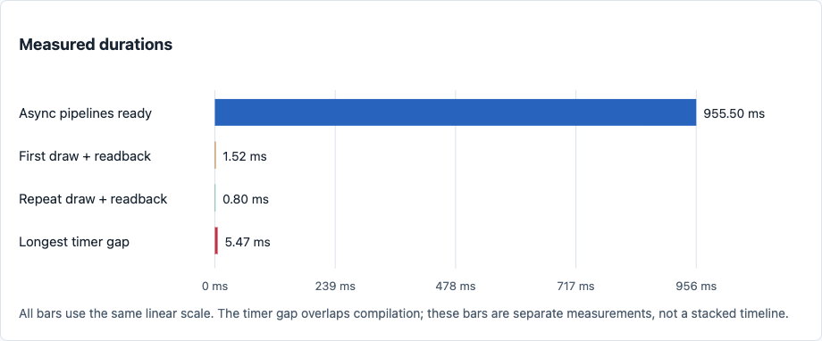
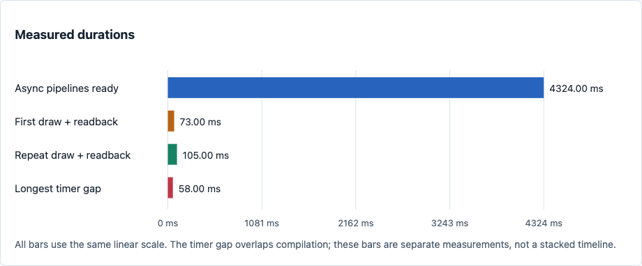

# WebGPU async pipeline compilation and first-use latency

Modern graphics apps and games can easily have thousands of shader permutations
for materials, lighting, shadows, and other features. They need to load and create
pipelines asynchronously in the background while continuing to render, and compile
many pipelines in parallel to minimize loading time. Fast startup and smooth resource
streaming are especially important for a good first user experience, when shaders
are not yet cached and compilation costs are highest.

This repro exposes issues in both Safari and Firefox. Safari stalls existing
rendering during async compilation and incurs another large first-use cost after
all `createRenderPipelineAsync` promises resolve. Firefox takes much longer to
create pipelines and has high readback latency, despite avoiding Safari's
multi-second event-loop freeze. Chrome and native Metal provide comparisons.

## Reproduce

**Safari, Chrome, or Firefox:** serve this directory with `python3 -m http.server 8000` and
open http://localhost:8000/. Keep the tab visible. The page runs automatically,
with no build or settings. Reload for another fresh batch.

**Native Metal:** with Xcode installed, run from this directory: `make run`

## Methodology

1. In the browser, continuously bounce a square using an existing pipeline on the
   same device, including during both draws and after the test finishes.
2. Submit 100 async pipeline requests in one burst, without throttling, allowing
   the implementation to compile them in parallel.
3. After every promise resolves, draw with all pipelines, then repeat with the
   exact same pipelines and resources. Verify all four integer channels per draw.

Every reload changes 128 random bits per shader throughout 64 unrolled arithmetic
rounds, defeating reuse of identical executables without clearing browser caches.
The [native control](native-metal.mm) uses equivalent fresh MSL shaders, submitting
all async library requests, then all async PSO requests, and waiting for both phases
to complete before drawing.

Draw times include encoding, execution, and readback, excluding CPU validation.
The browser measures gaps between callbacks requested every 4 ms during compilation;
the native control does not measure presentation or timer gaps.

**Expected:** rendering continues during background compilation, many pipelines
can compile concurrently, and completed async pipelines have no large first-use
penalty. Reloading with fresh shaders should preserve that behavior.

## Safari vs Chrome vs Firefox vs Native

Web and native measurements use fresh executable shaders on the same
Apple M3 and macOS 26.6.2, with visible browser windows. All charts use identical
dimensions and layout; each graph scales its own axis.

**Safari 26.6.2**

Pipeline promises resolve after 1.88 seconds, but the first draw then takes another
2.01 seconds, versus 1 ms for the repeat. A 1.87-second timer gap shows that the
main event loop also stalls during compilation. Async completion leaves expensive
work deferred until first use.

**Chrome 152**

Pipelines are ready in 0.96 seconds, with first/repeat draws of 1.52/0.80 ms and
a maximum timer gap of 5.47 ms. This run demonstrates background compilation
without a large event-loop stall or deferred first-use penalty.

**Firefox 153.0.4**

Firefox's chart reproduces the timings from a reported run, without changing values.
Pipeline creation took 4.32 seconds, with a 58 ms maximum timer gap: it avoided
Safari's multi-second event-loop freeze, but compilation and draw/readback
completion were slower than Chrome in these results. The 73/105 ms readbacks are
consistent with Firefox's [100 ms device polling interval](https://github.com/mozilla-firefox/firefox/blob/main/dom/webgpu/ipc/WebGPUParent.cpp).
This is a likely notification delay; these timings do not establish slow GPU execution.

| Measurement (ms) | Safari | Chrome | Firefox | Native Metal |
| --- | ---: | ---: | ---: | ---: |
| Async pipelines ready | 1880.12 | 955.50 | 4324.00 | 779.65 |
| First draw + readback | 2013.16 | 1.52 | 73.00 | 3.05 |
| Repeat draw + readback | 1.00 | 0.80 | 105.00 | 0.62 |
| Longest timer gap during compilation | 1871.52 | 5.47 | 58.00 | Not measured |

**Native Metal:** readiness totals 779.65 ms: async library creation (352.04 ms)
followed by async PSO creation (427.61 ms). First/repeat draws take 3.05/0.62 ms.
Completing native PSO creation before drawing avoids the multi-second first-use
penalty, even without offline compilation. This control does not test presentation.

All 800 output values matched in each automated Safari, Chrome, and native run.
Two fresh runs per tested browser confirmed this pattern; two earlier native runs
also measured first use below 5 ms.

Current [WebKit render pipeline code](https://github.com/WebKit/WebKit/blob/main/Source/WebGPU/WebGPU/RenderPipeline.mm)
returns from `createRenderPipelineAsync` before `renderPipelineState()` lazily
calls synchronous `newRenderPipelineStateWithDescriptor:error:`. Separately,
[canvas presentation](https://github.com/WebKit/WebKit/blob/main/Source/WebKit/WebProcess/GPU/graphics/WebGPU/RemoteCompositorIntegrationProxy.cpp)
uses synchronous IPC, matching the main-thread wait found in native Safari samples.
This identifies relevant WebKit paths; a patched WebKit build remains untested.

No complete application-side workaround was found in the Safari tests. The extra
compilation and synchronous waits occur inside WebKit's pipeline-use and
presentation paths, leaving no explicit compilation task that application code can
simply move to a worker. Moving the renderer to a worker can keep the page's main
thread responsive, but does not eliminate the deferred compilation cost or keep
rendering uninterrupted.
